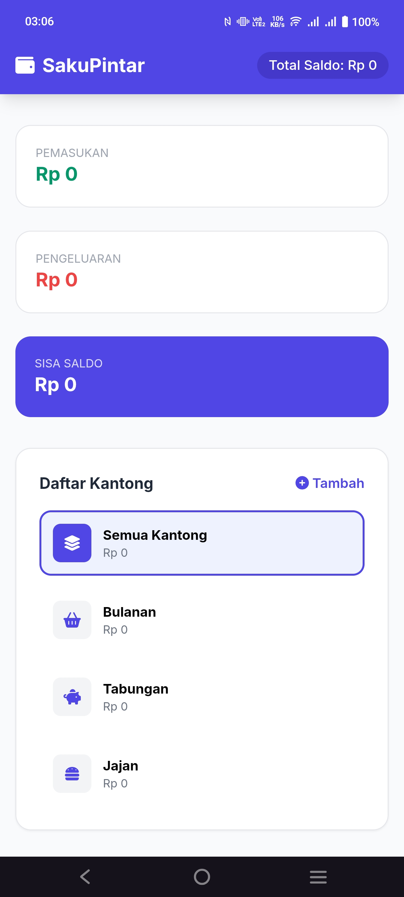
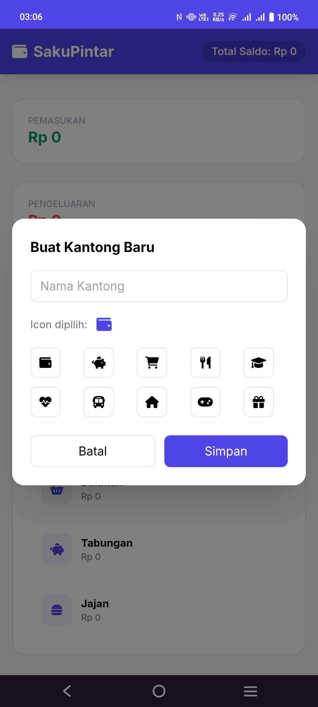
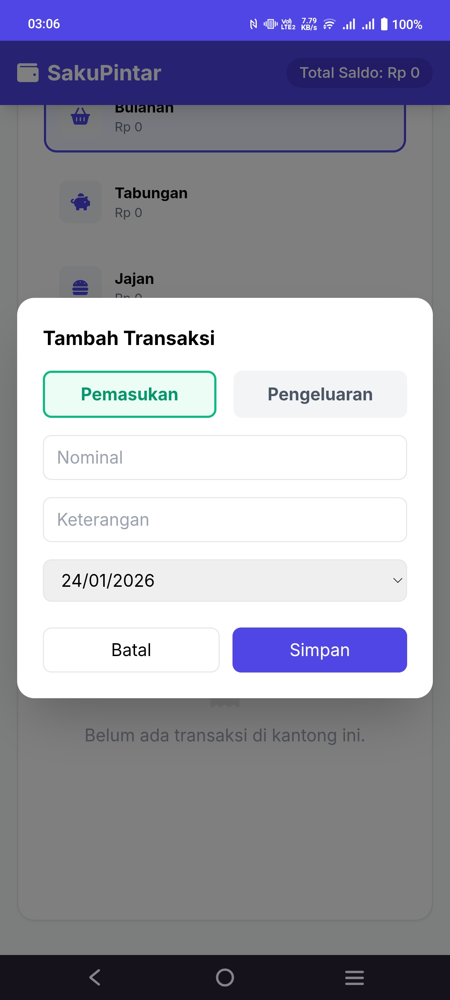
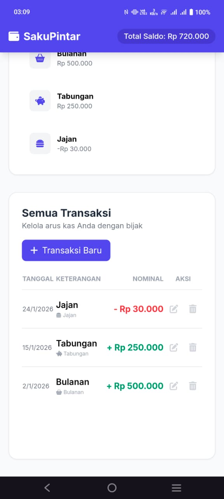

# SakuPintar

> **Akses Aplikasi:** [https://gilngpryga.github.io/SakuPintar/](https://gilngpryga.github.io/SakuPintar/)

SakuPintar adalah aplikasi pengelolaan keuangan pribadi berbasis web untuk membantu Anda **mengelola kantong uang**, **mencatat transaksi harian**, dan **memantau pemasukan serta pengeluaran** dengan mudah langsung dari browser atau layar utama ponsel Anda.

---

## ✨ Fitur Utama
* **Manajemen Kantong**: Pisahkan dana Anda ke dalam berbagai kategori (misal: Tabungan, Jajan, Bulanan).
* **Catatan Transaksi**: Input pemasukan dan pengeluaran secara cepat dan terorganisir.
* **Visualisasi Saldo**: Pantau total saldo secara real-time di bagian dashboard.
* **Privasi Maksimal**: Data Anda tidak dikirim ke server mana pun; semua tersimpan aman di `localStorage` perangkat Anda.
* **Dukungan PWA (Progressive Web App)**: Instal aplikasi langsung ke layar utama tanpa melalui App Store/Play Store.
* **Mode Offline**: Berkat Service Worker, aplikasi tetap dapat dibuka meski tanpa koneksi internet.

---

## 📸 Preview Aplikasi

  
  
  
  

---

## 📱 Panduan Instalasi

### Di iPhone (Safari)
1. Buka link [SakuPintar](https://gilngpryga.github.io/SakuPintar/) di browser **Safari**.
2. Klik tombol **Share** (ikon kotak dengan panah ke atas).
3. Gulir ke bawah dan pilih **'Add to Home Screen'** atau **'Tambah ke Layar Utama'**.
4. Klik **Add**. Ikon SakuPintar akan muncul di layar utama Anda.

### Di Android (Chrome)
1. Buka link di browser **Chrome**.
2. Klik ikon **titik tiga** di pojok kanan atas.
3. Pilih **'Install App'** atau **'Tambahkan ke Layar Utama'**.

---
